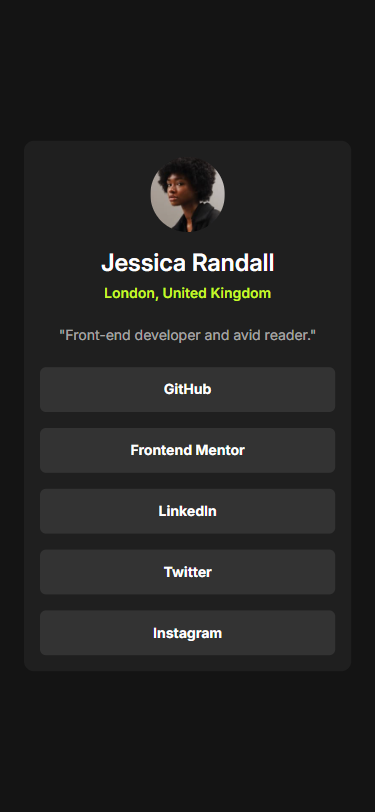
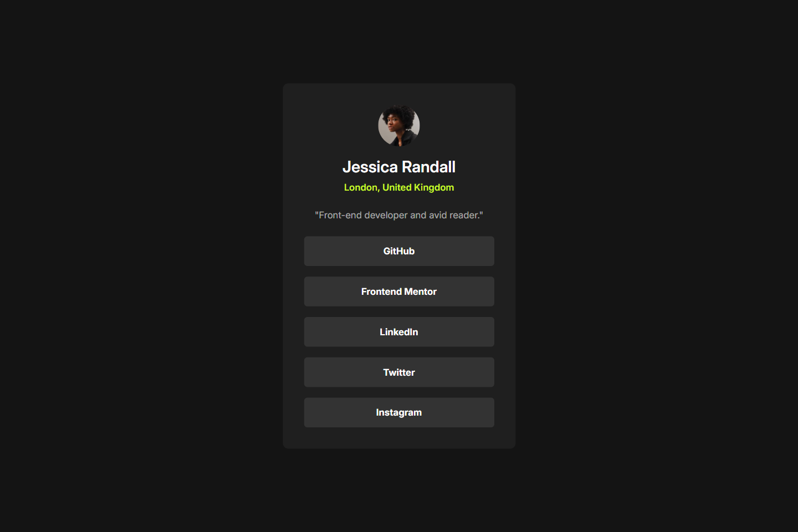

# 💻 Social Links Profile

## ℹ️ A Social Links Profile Landing Page

  <figure style="display: flex; flex-direction: column; justify-content: center; align-items: center; gap: 0.25em">
    
    <figcaption>
      <i>Mobile (375x812)</i>
    </figcaption>
  </figure>

  <figure style="display: flex; flex-direction: column; justify-content: center; align-items: center; gap: 0.25em">
    
    <figcaption>
      <i>Desktop (1440x960)</i>
    </figcaption>
  </figure>

This project is a responsive social links profile card, created using only HTML and CSS. It includes a profile image, user information, and links to social media platforms.

Created as part of the building challenges from [Frontend Mentor](https://www.frontendmentor.io/).

---

## 🔍 Overview

This webpage replicates a real-world social media profile component using only HTML and CSS. It was built from scratch following a strict style guide and design images.

The project adapts beautifully from mobile to desktop screens, uses semantic markup for accessibility, and provides a sleek dark mode interface using modern CSS techniques. A visually hidden "Skip to main content" link was also added for improved screen reader navigation.

---

## ✨ Features

- Responsive design (mobile-first approach)
- Dark mode using `color-scheme: dark`
- Accessibility support with semantic HTML and ARIA
- Mobile-optimized layout (320px up to desktop)
- Interactive link hover states with transition effects
- Social media links with ARIA-labels for screen readers
- Image optimization with `width`/`height` and alt text
- Clean and scalable CSS with custom properties

---

## 🧠 What I Learned

- How to structure and build a responsive layout using **mobile-first design principles**
- Use of **ARIA roles and labels** to improve accessibility of social navigation
- Writing **accessible and semantic HTML** (including skip links)
- Managing design tokens with **CSS custom properties (variables)**
- Implementing hover and focus styles that follow **WCAG accessibility** guidelines
- How to use **Open Graph and Twitter meta tags** to prep a page for social sharing
- How to create **dark mode–friendly UIs** with minimal extra effort

---

## 🛠️ Tech Used

- HTML5
- CSS3
- Git
- GitHub
- Netlify

---

## 🚀 How to Run

1. Clone the repository
2. Open `index.html` in your browser

---

## 🌐 Live Demo

Or you can check out the 👉 [live website here](SITE_LINK)

---

## 🧑‍💻 Author

Created by **Elmar Chavez**

🗓️ Month/Year: **June 2025**

📚 Journey: **3rd** month of learning _frontend web development_.

<!--

FRONTEND MENTOR TAGS:
html css vscode git github netlify 3rd-month frontend-mentor project

-->
